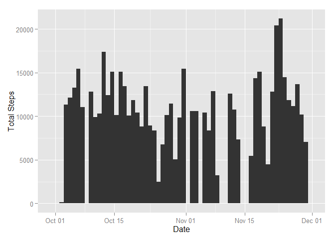
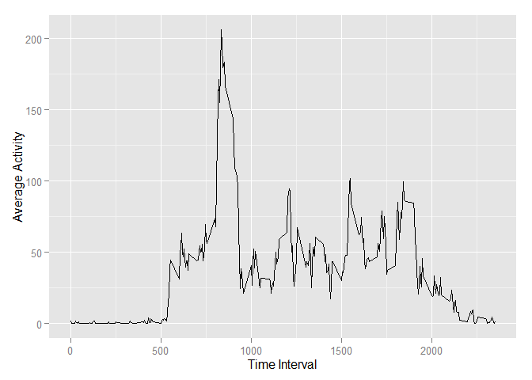
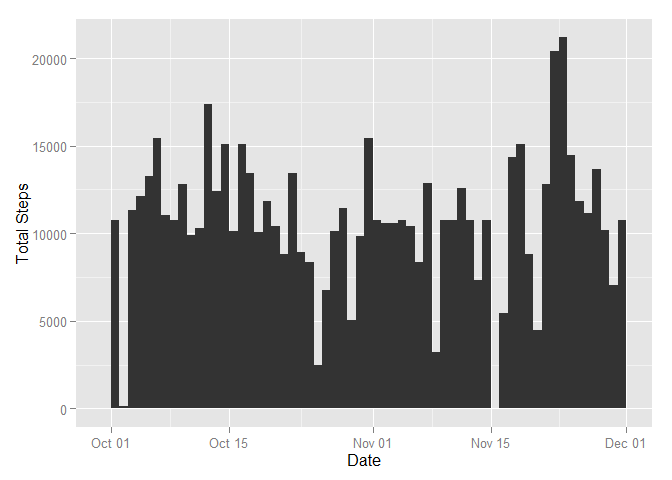
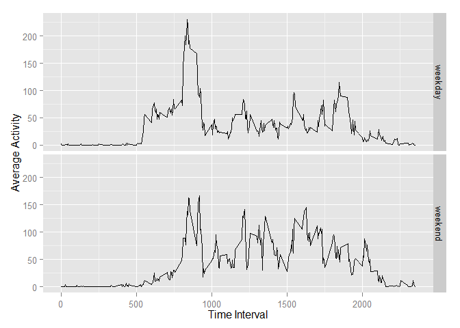

# Reproducible Research: Peer Assessment 1


## Loading and preprocessing the data

Start by loading the CSV data.


```r
setwd('C:/Users/Thomas/Documents/GitHub/RepData_PeerAssessment1')
activity <- read.csv('activity.csv')
```

The CSV data is loaded as 'data.frame' and its 'date' column as 'factor'. Convert the class of date column to 'date' so that the dates in the column could be identified as continuous.


```r
activity$date <- as.Date(activity$date, format='%Y-%m-%d')
```

Preprocess of the data is done.
<br>
<br>
<br>

## What is mean total number of steps taken per day?

Start by including the charting package 'ggplot2'.


```r
library('ggplot2')
```

To make a histogram of the total number of steps taken each day, group the data set by 'date' column and sum the 'steps' columns, and then parse it to the plot function.


```r
noOfStepsPerDay <- aggregate(activity$steps, by=list(activity$date), FUN=sum, na.rm=TRUE)
p <- qplot(Group.1, weight=x, data=noOfStepsPerDay, geom="histogram", binwidth=1)
p <- p + xlab("Date")
p + ylab("Total Steps") 
```

 

The 'summary' function calculate a set of statistics on the given vector. Parse in the total steps per day (i.e. 'noOfStepsPerDay$x') to get the 'mean' and 'median'.


```r
summary(noOfStepsPerDay$x)
```

```
##    Min. 1st Qu.  Median    Mean 3rd Qu.    Max. 
##       0    6780   10400    9350   12800   21200
```
<br>
<br>

## What is the average daily activity pattern?

Make a time series plot of the 5-minute interval and the average number of steps taken, averaged across all days. The 'aggregate' function is used again for this question, but this time the 'mean' function is used for calculating average.


```r
noOfStepsMinAvg <- aggregate(activity$steps, by=list(activity$interval), FUN=mean, na.rm=TRUE)
p <- ggplot(noOfStepsMinAvg, aes(Group.1, x)) + geom_line()
p <- p + xlab("Time Interval")
p + ylab("Average Activity")
```

 

Use the following code to find out the 5-minute interval, on average across all the days in the dataset, contains the maximum number of steps.


```r
itvl5min <- noOfStepsMinAvg[noOfStepsMinAvg$x == max(noOfStepsMinAvg$x), 1]
itvl5min
```

```
## [1] 835
```

835 is the 5-minute interval which contains the maximum number of steps in average.
<br>
<br>

## Imputing missing values

Use the following code to find out number of missing values.


```r
nrow(activity[is.na(activity$steps), ])
```

```
## [1] 2304
```

Note that there are a number of days/intervals where there are missing values (coded as 'NA'). The presence of missing days may introduce bias into some calculations or summaries of the data. These  missing fields can be assigned with the mean for that 5-minute interval. (note: means are calculated already in 'noOfStepsMinAvg' when answering last question.)


```r
activityNew <- merge(activity, noOfStepsMinAvg, by.x=c('interval'), by.y=c('Group.1'))
activityNew[is.na(activityNew$steps), 'steps'] <- activityNew[is.na(activityNew$steps), 'x']
```

Histogram of the total number of steps taken each day can be plotted again for observing the difference before and after replacing 'NA' values interval-average.


```r
noOfStepsPerDay <- aggregate(activityNew$steps, by=list(activityNew$date), FUN=sum, na.rm=TRUE)
p <- qplot(Group.1, weight=x, data=noOfStepsPerDay, geom="histogram", binwidth=1)
p <- p + xlab("Date")
p + ylab("Total Steps") 
```

 

And get the summary statistics again by 'summary' function.


```r
summary(noOfStepsPerDay$x)
```

```
##    Min. 1st Qu.  Median    Mean 3rd Qu.    Max. 
##      41    9820   10800   10800   12800   21200
```

The mean and median are higher than those before replacing 'NA' values. Imputing missing data can reduce the occurance of outlier which caused by data-capture failure.
<br>
<br>

## Are there differences in activity patterns between weekdays and weekends?

Create a new factor variable in the dataset with two levels - "weekday" and "weekend" indicating whether a given date is a weekday or weekend day.


```r
activityNew["isWeekend"] = NA
activityNew[weekdays(activityNew$date) %in% c('Saturday', 'Sunday'), ]$isWeekend = "weekend"
activityNew[!(weekdays(activityNew$date) %in% c('Saturday', 'Sunday')), ]$isWeekend = "weekday"
activityNew$isWeekend <- as.factor(activityNew$isWeekend)
str(activityNew)
```

```
## 'data.frame':	17568 obs. of  5 variables:
##  $ interval : int  0 0 0 0 0 0 0 0 0 0 ...
##  $ steps    : num  1.72 0 0 0 0 ...
##  $ date     : Date, format: "2012-10-01" "2012-11-23" ...
##  $ x        : num  1.72 1.72 1.72 1.72 1.72 ...
##  $ isWeekend: Factor w/ 2 levels "weekday","weekend": 1 1 2 1 2 1 2 1 1 2 ...
```

Make a panel plot containing a time series plot of the 5-minute interval (x-axis) and the average number of steps taken, averaged across all weekday days or weekend days (y-axis).


```r
noOfStepsMinAvg <- aggregate(activityNew$steps, 
                             by=list(activityNew$interval, activityNew$isWeekend), 
                             FUN=mean, na.rm=TRUE)

p <- ggplot(noOfStepsMinAvg, aes(Group.1, x)) + geom_line() + facet_grid(Group.2 ~ .)
p <- p + xlab("Time Interval")
p + ylab("Average Activity")
```

 
